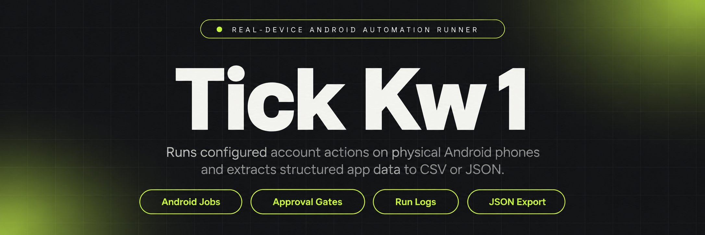
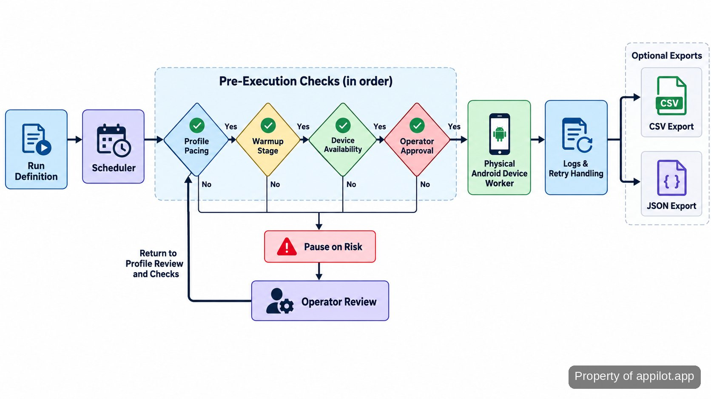

<p align="center">
  <a href="https://www.appilot.app" target="_blank" rel="nofollow">
    
  </a>
</p>

## tick kw 1

`tick kw 1` is the real-device automation runner in this repository. It schedules account actions on physical Android phones, routes work to the right device and profile, applies pacing and approval rules, records each action, retries recoverable failures, and can export structured app data as CSV or JSON. The point is not to make automation invisible or ban-proof. The point is to replace hand-driving many phones with a queue that still leaves risky actions under operator control.

I run it as a local control service with the phones attached to the same machine. A profile means the account-specific session and settings used for one account; warmup means staged activity before heavier usage; a rate limit is the per-account pacing rule that restricts how quickly actions are queued. Those controls are explicit in configuration rather than buried in the device script.

> Physical phones do the work; the scheduler, approval gate, logs, retries, and exports keep the run understandable.

<a href="https://www.appilot.app" target="_blank" rel="nofollow">
  
</a>

<p align="center">
  <a href="https://t.me/Bitbash333" target="_blank" rel="nofollow">
    
  </a>&nbsp;
  <a href="https://wa.me/923249868488?text=Hi%2C%20I%27m%20interested." target="_blank" rel="nofollow">
    
  </a>&nbsp;
  <a href="mailto:hello@appilot.app" target="_blank" rel="nofollow">
    
  </a>&nbsp;
  <a href="https://www.appilot.app" target="_blank" rel="nofollow">
    
  </a>
</p>

## What the runner does

The tool takes a run definition containing a device or device group, a profile group, an action plan, a schedule, pacing rules, approval requirements, and export settings. It turns that definition into queued jobs. Before a job reaches a phone, the controller checks that the target device is available, that the profile is eligible to run, and that any approval requirement has been satisfied. Jobs that pass those checks are handed to the Android worker; jobs that do not stay visible in the queue instead of disappearing into a script.

That separation matters when many accounts are active at once. Scheduling is centralized, but execution remains attached to a specific physical device and profile. The same run record also captures logs, retry state, pauses, and export paths, so an operator can answer three basic questions without opening a phone: what was supposed to run, what actually happened, and what needs attention next.

## Core Features

| Feature | Description |
| --- | --- |
| Physical Android sessions | Manual phone-by-phone work is hard to repeat consistently. Jobs are routed to genuine Android hardware and tied to a named device and profile instead of an emulator pool. |
| Central schedules and queues | Keeping separate timers for many accounts creates missed or overlapping work. The scheduler turns run definitions into queued jobs and keeps pending work in one place. |
| Warmup-aware pacing | A single speed setting ignores account state. Per-profile pacing and warmup stages control when actions can be queued and keep heavier activity from starting before the configured stage. |
| Approval gates | High-risk actions should not fire simply because a timer expired. Jobs that require review remain pending until an operator approves them. |
| Logs and retries | A failed tap or dropped device should not become a silent gap. Each job records its state, and recoverable failures can return to the retry path. |
| Pause-on-risk rules | Continuing after warning conditions compounds the problem. Profile health rules can pause work so the operator can inspect the account before more actions are sent. |
| Structured exports | Copying extracted app data by hand makes later analysis fragile. Field mappings normalize captured values and write structured CSV or JSON output. |

## How a run moves through the system

A run begins with configuration, not with a device tap. The scheduler reads the selected profile group and action plan, expands them into account-level jobs, then checks pacing, warmup stage, device availability, and any approval gate. Only an eligible job is dispatched. The Android worker opens the required app session on the assigned phone, performs the configured action sequence, and returns status plus any captured fields. The controller then writes the run log, queues a retry when the failure is marked recoverable, pauses the profile when a risk rule triggers, and writes export files when extraction is part of the plan.

The useful failure mode here is visible waiting. A blocked approval, unavailable device, or paused profile remains a state the operator can inspect. It is not treated as a successful run, and it is not hidden by an automatic loop. That makes overnight work easier to review in the morning because the queue explains why something did not run.



## Technical Stack

The controller is Python-based. <a href="https://docs.python.org/3/" target="_blank" rel="nofollow">Python</a> keeps the scheduler, device worker, export code, and CLI in one runtime. <a href="https://developer.android.com/tools/adb" target="_blank" rel="nofollow">Android Debug Bridge</a> is the device transport used to discover attached phones and communicate with them; the first hardware check is therefore `adb devices`. <a href="https://appium.io/docs/en/2.4/quickstart/test-py/" target="_blank" rel="nofollow">Appium</a> drives the app UI on those physical devices rather than replacing them with browser automation.

<a href="https://apscheduler.readthedocs.io/en/master/userguide.html" target="_blank" rel="nofollow">APScheduler</a> owns due-job scheduling, while <a href="https://fastapi.tiangolo.com/tutorial/" target="_blank" rel="nofollow">FastAPI</a> serves the local operator interface and status endpoints. <a href="https://www.sqlite.org/docs.html" target="_blank" rel="nofollow">SQLite</a> stores run, job, device, profile, approval, and retry state locally. Exporters use Python's standard <a href="https://docs.python.org/3/library/csv.html" target="_blank" rel="nofollow">CSV</a> and JSON libraries. For mobile-device hygiene, the operational checklist is cross-checked against the <a href="https://mas.owasp.org/MASVS/" target="_blank" rel="nofollow">OWASP Mobile Application Security Verification Standard</a> and NIST's <a href="https://www.nist.gov/publications/guidelines-managing-security-mobile-devices-enterprise-0" target="_blank" rel="nofollow">mobile-device security guidance</a>; those are reference baselines, not claims of certification.

<a href="https://tally.so/r/yP5oDx?platform=GitHub&amp;format=Product+repo&amp;brand=Appilot&amp;niche=appilot&amp;page=Tick+Kw+1+on+Android+Hardware&amp;date=2026-09-26" target="_blank" rel="nofollow">
  
</a>

## Project Directory

The repository keeps device control separate from scheduling and account policy. That split is practical: a selector change in an app should stay inside the device layer, while a pacing or approval change belongs in policy and queue code. Exports are isolated again so a field-mapping change does not alter the action runner. Configuration lives outside the package, and runtime data is written under `var/` rather than mixed with source files.

```text
device-runner/
├── config/
│   ├── devices.yaml
│   ├── profiles.yaml
│   ├── plans.yaml
│   └── policies.yaml
├── src/
│   ├── api.py
│   ├── cli.py
│   ├── scheduler.py
│   ├── queue.py
│   ├── approvals.py
│   ├── health.py
│   ├── devices/
│   │   ├── adb.py
│   │   └── appium_worker.py
│   └── exports/
│       ├── csv_export.py
│       └── json_export.py
├── tests/
│   ├── test_queue.py
│   ├── test_policies.py
│   └── test_exports.py
├── var/
│   ├── runs.db
│   ├── logs/
│   └── exports/
├── requirements.txt
└── README.md
```

The important boundary is `config/` versus `var/`: configuration is reviewable and can be versioned; run state, logs, and extracted datasets are local operational data. Before committing changes, check that runtime files are excluded from version control and that profile secrets are not stored in YAML.

## How to Run Device Jobs Using tick kw 1

Set up the local controller first, confirm the phones are visible, then use the operator screen to queue a run. The repository is the source of the build; there is no separate hosted account required for the controller.

```bash
python -m venv .venv
source .venv/bin/activate
pip install -r requirements.txt
adb devices
python -m src.api
```

- **STEP 1 - Download & Set Up the Project** - Download, set up, and install **tick kw 1** from this repository, create the Python environment, install requirements, and verify the attached phones.
- **STEP 2 - Open the Operator Screen** - Start `python -m src.api`, open the local dashboard, and confirm each expected device is present before adding account work to the queue.
- **STEP 3 - Configure the Run** - Choose the device group, profile group, action plan, schedule, pacing policy, approval requirement, and CSV or JSON export setting exposed by the run form.
- **STEP 4 - Queue and Review** - Select `Queue Run`. Watch job states, approve gated actions when required, then review logs and the export path after the run finishes.

## Use Cases

The same control loop applies to several account-heavy jobs, but the action plan and policy should remain specific to the work. I keep separate plans rather than turning one giant script into a switchboard; that makes logs readable and reduces the chance that a change intended for one workflow affects another.

- Run scheduled outreach or engagement across assigned accounts while keeping rate limits, profile pacing, and approval gates visible to the operator.
- Stage account warmup on real phones, moving profiles through configured activity levels and pausing profiles when a health rule says they need review.
- Extract structured fields from a mobile app session and write normalized CSV or JSON datasets instead of copying values from devices into a spreadsheet by hand.
- Operate a physical device fleet from one queue, with per-device logs and retries that make disconnected phones or failed actions visible before the next run.

## Run Checks and Failure Recovery

I do not use a blanket actions-per-hour number as a performance claim because the configured pace is intentionally different per account and warmup stage. The checks that matter are operational: queue delay, action duration, retry count, device disconnects, paused profiles, and export completeness. Those values come from the local run records rather than from a marketing benchmark.

Before an overnight run, `adb devices` should show every expected phone and the dashboard should show no unexplained paused profiles. During the run, failures are split into recoverable and review-required states. A recoverable device or UI failure can re-enter the retry path; a policy or health stop does not. Afterward, the operator reviews failed jobs, confirms gated actions were handled as intended, and checks that any extraction plan produced its configured CSV or JSON file.

The main safety boundary is deliberately boring: the runner controls timing, queues, approvals, retries, and pauses, but it cannot decide whether a platform will flag or ban an account. Treat those controls as operational discipline, not as a guarantee of platform acceptance.

## FAQ

### Does this run on real Android phones or emulators?

It runs its mobile jobs on physical Android phones. The controller uses ADB for device visibility and Appium for UI-level actions, while schedules, logs, approvals, retries, and exports remain on the local control machine. The repository does not describe an emulator execution path.

### What happens when a device or job fails?

The job remains visible with a failure state instead of being treated as completed. Recoverable device or UI failures can return to the retry path; approval blocks, health pauses, and other review-required states stay pending for an operator. Logs keep the device, profile, action plan, and run context together for diagnosis.

### How are rate limits, warmup, and approvals handled?

They are configuration and policy controls applied before dispatch. Each profile can be governed by pacing and warmup state, and plans can require operator approval before higher-risk actions enter the device queue. These controls reduce accidental over-queuing and preserve human review, but they do not promise that an external platform will accept the activity.

<table>
  <tr>
    <td align="center" width="33%">
      
      <p>This scraper helped me gather thousands of posts effortlessly. The setup was fast, and exports are super clean and well-structured.</p>
      <p><b>Nathan Pennington</b><br>Marketer<br>★★★★★</p>
    </td>
    <td align="center" width="33%">
      
      <p>What impressed me most was how accurate the extracted data is. Likes, comments, timestamps — everything aligns perfectly.</p>
      <p><b>Greg Jeffries</b><br>SEO Affiliate Expert<br>★★★★★</p>
    </td>
    <td align="center" width="33%">
      
      <p>It's by far the best tool I've used. Ideal for trend tracking, competitor monitoring, and influencer insights.</p>
      <p><b>Karan</b><br>Digital Strategist<br>★★★★★</p>
    </td>
  </tr>
</table>